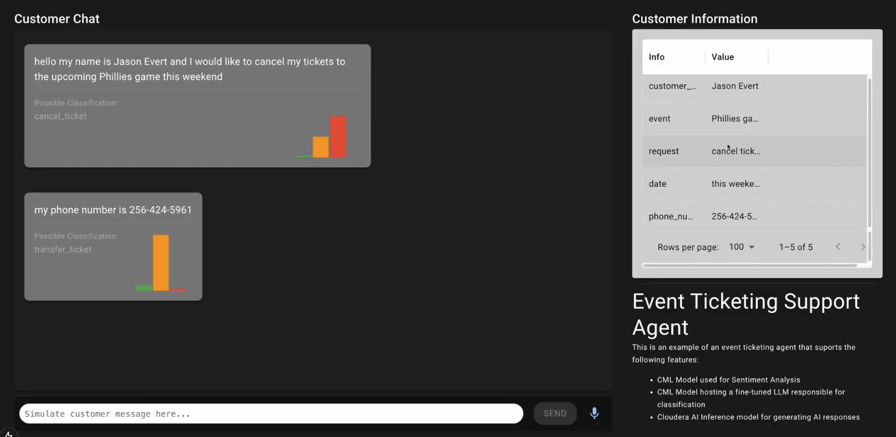

# Event Ticketing Customer Support Tool

A basic customer support tool that emulates how different AI/ML models can be used to enhance customer support personnel during a phone or chat conversation with a customer. This tool is assumed to be used for an event or concert ticketing company/support line.



Features:
* Speech Recognition using [WebKit APIs](https://developer.mozilla.org/en-US/docs/Web/API/SpeechRecognition) (this only works in chrome)
* Sentiment analysis using a classical [transformers pipeline](https://huggingface.co/docs/transformers/en/main_classes/pipelines)
* Classification analysis performed with a `bigscience/bloom-1b1` LLM and a fine-tuned QLoRA adapter [(learn about how it was trained here)](https://blog.cloudera.com/introducing-cloudera-fine-tuning-studio-for-training-evaluating-and-deploying-llms-with-cloudera-ai/)
* Entity extraction using any [OpenAI compliant chat completions endpoint](https://platform.openai.com/docs/api-reference/chat/create) (not fine-tuned, so big model is better!)
* Front-end written with [NextJS / Typescript](https://nextjs.org/)
* Most front-end code uses [MUI](https://mui.com/) components because they're awesome and easy
* Compatible as a [Cloudera Applied ML Prototype](https://docs.cloudera.com/machine-learning/cloud/applied-ml-prototypes/topics/ml-amps-overview.html), can be installed directly in a workspace

## Overview

### Frontend

* The frontend code is written with NextJS and MUI. Entrypoint can be found in `app/page.ts` where the main component is a `CustomerSupport` component.
* This is a single-page application
* All of the components are written in `components/`, and most of the components run on the client side (in the browser)
* The interface classes for calling the AI/ML models are under `lib/`. Most of these are simple `POST` commands to an endpoint with hardcoded prompts.
* WebKit Speech Recognition APIs are used to listen to customer speech input through the browser. Only works with Chrome!

Frontend code pointers:
* The app starts in `app/page.tsx`.
* The external AI model calls, or an example of one, is the `lib/SentimentClient.ts`, which just calls an external sentiment model
* The entity extraction model is in `lib/CustomerInfoClient.ts`.
* The speech recognition logic all happens in `components/CustomerMessage.tsx`.

### Models

* Sentiment model and Classification model are written with Python and it's assumed you have a GPU available to run the models.
* Right now these models assume you're running on Cloudera AI, as there's no way to just install the model locally as an endpoint
  * However in the near future I'll add FastAPI endpoint support for local development for folks that want to just spin up everything locally
* The Sentiment model is a transformers pipeline model.
* The classification model is a [`bigscience/bloom-1b1` text generation model](https://huggingface.co/bigscience/bloom-1b1) with a [trained QLoRA adapter](https://medium.com/@dillipprasad60/qlora-explained-a-deep-dive-into-parametric-efficient-fine-tuning-in-large-language-models-llms-c1a4794b1766)
  * The trained adapter specifically guides the model to output just a couple tokens of `snake_case` classification. It was trained with Cloudera's [Fine Tuning Studio](https://blog.cloudera.com/introducing-cloudera-fine-tuning-studio-for-training-evaluating-and-deploying-llms-with-cloudera-ai/).

Backend/Model Code Pointers:
* The sentiment model is defined in `models/sentiment/sentiment_model.py`.
* The classification model is defined in `models/ticketing-classification/classification_model.py`. The adapter lives in `models/ticketing-classification/bloom-1b-ticketing-adapter/`.
* The entity extraction model just assumes an OpenAI chat completions endpoint. You can see this code in `lib/CustomerInfoClient.ts`.

## Running the Application

### Running Locally

Local instructions for running the model are TBD since this was originally designed to run as a Cloudera AMP.

### Starting the Node server

Some loose instructions on what's required to run locally
* Get node. [nvm](https://github.com/nvm-sh/nvm) is recommended as the node version manager. Tested with Node 20.

```bash
curl -o- https://raw.githubusercontent.com/nvm-sh/nvm/v0.40.1/install.sh | bash
nvm install 20
```

* Make a python environment and install `requirements.txt` if you want to run the models. (NOTE: right now this isn't yet supported so the Python stuff can be skipped)

```bash
conda create --name ticketing
conda activate ticketing
conda install python=3.11
pip install -r requirements.txt
```

* Install node modules.

```bash
npm install
```

* Finally, run the app.

```bash
npm run dev
```

Right now the backend AI/ML models do not run without API Keys and without dedicated endpoints which are currently only supported in Cloudera AI. More instructions to follow on running the models locally.

### Running as a Cloudera AMP

> **NOTE: Not yet ready to deploy as an AMP. WIP!**

Users can deploy the application as a one-click application through Cloudera's AI Workbench.

> IMPORTANT: Please read the following before proceeding. This AMP includes or otherwise depends on certain third party software packages. Information about such third party software packages are made available in the notice file associated with this AMP. By configuring and launching this AMP, you will cause such third party software packages to be downloaded and installed into your environment, in some instances, from third parties' websites. For each third party software package, please see the notice file and the applicable websites for more information, including the applicable license terms. If you do not wish to download and install the third party software packages, do not configure, launch or otherwise use this AMP. By configuring, launching or otherwise using the AMP, you acknowledge the foregoing statement and agree that Cloudera is not responsible or liable in any way for the third party software packages.